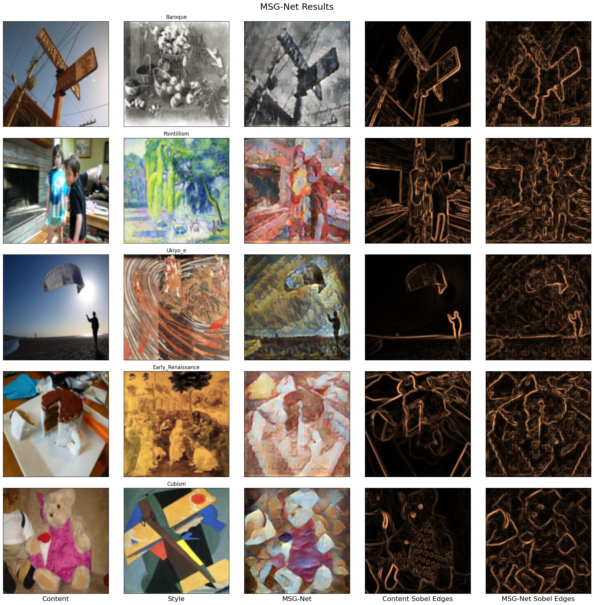

# 
Image Style Transfer

> Сравнение традиционных сверточных нейросетей (CNN) и генеративных сетей для задачи передачи стиля изображения

## О чем?

Передача стиля изображения — это техника, которая объединяет художественные особенности эталонного изображения-стиля с содержанием целевого изображения. Цель данного проекта — исследовать и реализовать передачу стиля изображения с использованием генеративных состязательных сетей (GAN), а также сравнить их производительность с традиционными сверточными нейронными сетями. В реализации мы сосредоточились на CycleGAN и MSG-Net, чтобы изучить, как современные методы улучшают качество и реализм изображений с перенесённым стилем.

    

## Как?

Веса и параметры модели, использованные или полученные в этом проекте, доступны по ссылке на Google Drive: https://drive.google.com/drive/folders/1ovGMDYQHxhdcZY7gNQOsJixpLzM8lHLl?usp=sharing

Для запуска скачайте веса и поместите их в папку ./models/output/*

## Кто?

| name               | tg             |
|-------------------|---------------------|
| Серикова Светлана | @chtozaserikova     |
| Назарова Дарья    | @xrosnex            |
| Шурыгин Всеволод  | @v7evo10d           |
